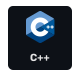
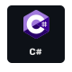
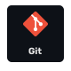

<!--
**Muza21/Muza21** is a ✨ _special_ ✨ repository because its `README.md` (this file) appears on your GitHub profile.

Here are some ideas to get you started:

- 🔭 I’m currently working on ...
- 🌱 I’m currently learning ...
- 👯 I’m looking to collaborate on ...
- 🤔 I’m looking for help with ...
- 💬 Ask me about ...
- 📫 How to reach me: ...
- 😄 Pronouns: ...
- ⚡ Fun fact: ...
-->

<!-- RAINBOW LINE BOT -->

### Hi there 👋

  
:zap: Github Stats

   

  
:zap: Most Used Languages

  

### 🛠️ Technologies and Tools 🛠️

  
  
  
  
  
  
  
  
  
  
  
  

### About me

🔭 I’m on a PHP adventure, crafting a cool web app. It’s a real dive into coding and a playground for learning all the PHP tricks.

🌱 PHP OOP is my jam right now. It’s all about writing code that’s clean, organized, and super easy to update. Totally digging this modern coding vibe!

📫 How to reach me: [Email me!](mailto:lasha.2017.muzashvili@gmail.com)
